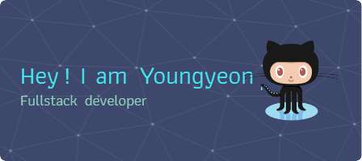

 

## 🔭 I’m currently working on 🔭

kepco

 

## 🌱 I’m currently learning 🌱

<!--

#### 대한민국 해군 병 680기 CERT

#### 한국전력공사 440기 ICT (KEPCO)

#### 한국디지털미디어고등학교 17기 해킹방어과 (KDMHS)

### 
  

**young-yeon/young-yeon** is a ✨ _special_ ✨ repository because its `README.md` (this file) appears on your GitHub profile.

Here are some ideas to get you started:

- 🔭 I’m currently working on ...
- 🌱 I’m currently learning ...
- 👯 I’m looking to collaborate on ...
- 🤔 I’m looking for help with ...
- 💬 Ask me about ...
- 📫 How to reach me: ...
- 😄 Pronouns: ...
- ⚡ Fun fact: ...
-->
